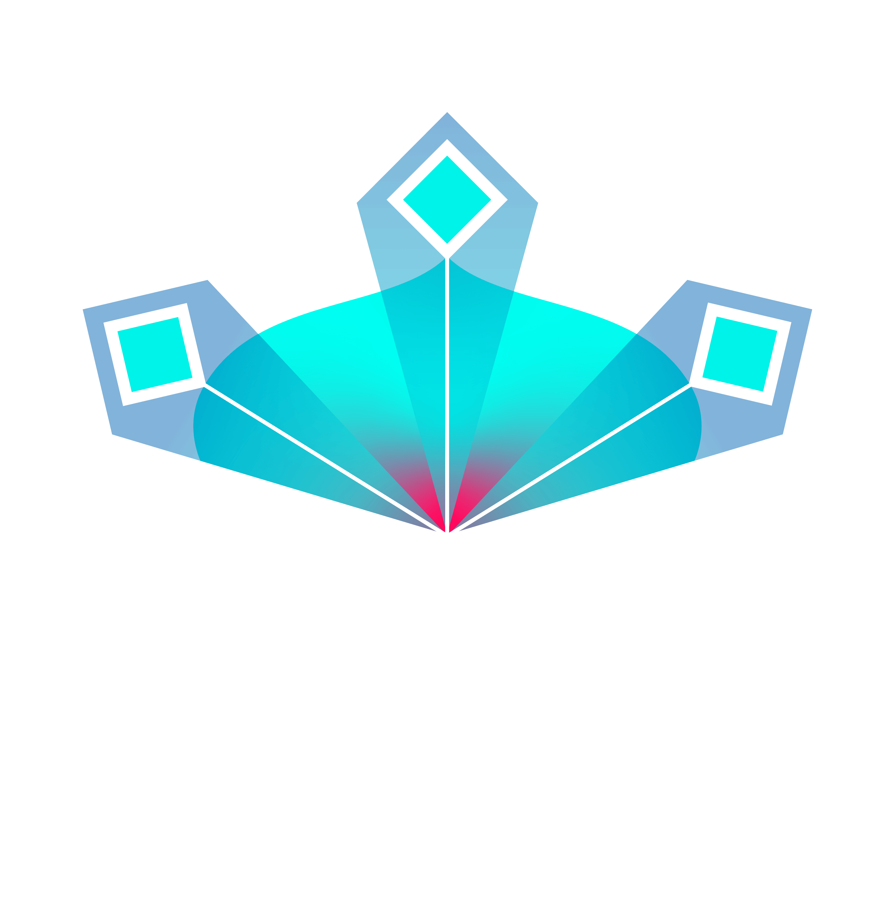

FEDn is a modular and model agnostic framework for Hierarchical Federated Machine Learning. Scale seamlessly from pseudo-distributed development to real-world production networks in distributed, heterogeneous environments.

Community support: [Scaleout Discord server](https://discord.gg/KMg4VwszAd) 

## Core Features

- **ML-framework agnostic**. Model updates are treated as black-box computations. This means that it is possible to support virtually any ML model type or framework. Support for Keras and PyTorch is available out-of-the-box, and support for many other model types, including models from SKLearn, are in active development.
- **Hierarchical Federated Learning for high scalability**. FEDn allows for massive horizontal scaling. This is achieved by a hierarchical architecture where multiple combiners divide up the work to coordinate client updates and aggregation. Recent benchmarks show high performance both for thousands of clients in a cross-device setting and for large model updates (1GB) in a cross-silo setting, see https://arxiv.org/abs/2103.00148.
- **Built for real-world production scenarios**. The implementation is based on proven design patterns in distributed computing and incorporates enterprise security features. A key feature is that clients do not have to expose any ingress ports.
- **UI to manage alliances, track training progress and follow client validations in real time**. FEDn has a UI that lets you efficiently track events, training progress, visualize model validations accross the federation, and monitor both client and server performance.   

## Documentation 
More details about the architecture and implementation:  
- [Documentation](https://scaleoutsystems.github.io/fedn/)
- [Paper](https://arxiv.org/abs/2103.00148)

## Getting started 

The easiest way to start with FEDn is to use the provided docker-compose templates to launch a pseudo-distributed environment consisting of one Reducer, one Combiner, and a few Clients. Together with the supporting storage and database services this makes up a minimal system for developing a federated model and learning the FEDn architecture.  

Clone the repository and follow these steps:

### Pseudo-distributed deployment
We provide docker-compose templates for a minimal standalone, pseudo-distributed Docker deployment, useful for local testing and development on a single host machine. 

1. Create a default docker network  

We need to make sure that all services deployed on our single host can communicate on the same docker network. Therefore, our provided docker-compose templates use a default external network 'fedn_default'. First, create this network: 

````bash 
docker network create fedn_default
````

2. Deploy the base services (Minio and MongoDB)  

````bash 
docker-compose -f config/base-services.yaml -f config/private-network.yaml up 
````

Make sure you can access the following services before proceeding to the next steps: 
 - Minio: http://localhost:9000
 - Mongo Express: http://localhost:8081

(You can update username and password for the services in config/base-services.yaml, default values: user=fedn_admin, password=password)
 
3. Start the Reducer  

Copy the settings config file for the reducer, 'config/settings-reducer.yaml.template' to 'config/settings-reducer.yaml'. You do not need to make any changes to this file to run the sandbox. To start the reducer service:

````bash 
docker-compose -f config/reducer.yaml -f config/private-network.yaml up 
````

Make sure that you can access the Reducer UI at https://localhost:8090. 

4. Start a combiner  

Copy the settings config file for the combiner, 'config/settings-combiner.yaml.template' to 'config/settings-combiner.yaml'. You do not need to make any changes to this file to run the sandbox. To start the combiner service and attach it to the reducer:

````bash 
docker-compose -f config/combiner.yaml -f config/private-network.yaml up 
````

You should now see the combiner listed in the 'Network' view in the UI.  

### Train a federated model

Training a federated model on the FEDn network involves: 

 1. Configuring the network with a compute package (containing the code that will be distributed to clients)
 2. Setting an initial model (untrained or pre-trained)
 3. Attaching clients to the network 

Follow the instruction here to set up your deployed network to train a model for digits classification using the MNIST dataset: 
https://github.com/scaleoutsystems/examples/tree/main/mnist-keras

## Distributed deployment
We provide instructions for a distributed reference deployment here: [Distributed deployment](https://scaleoutsystems.github.io/fedn/#/deployment). 

## Where to go from here
- [Understand the architecture](https://scaleoutsystems.github.io/fedn/#/architecture) 
- [Understand the compute package](https://scaleoutsystems.github.io/fedn/tutorial.html)

## Additional examples 
We maintain a list of external examples. If you have an example that you want to include, talk to a core developer in [Discord](https://discord.gg/CCRgjpMsVA). 

**Federated learning/FEDn**
- [NLP and IoT use case from the FEDn paper](https://github.com/scaleoutsystems/examples) maintained by Scaleout and ISCL. 
- [FedBird - Federated object detection for Baltic Seabirds](https://github.com/aidotse/fedbird) FEDn project maintained by AI Sweden and Zenseact. 
- [FEDn in AI Sweden EdgeLab](https://github.com/aidotse/EdgeLab/tree/main/tutorials/fedn) Instructions for running fully distributed FEDn in [EdgeLab](https://www.ai.se/en/data-factory/edge-lab) maintained by AI Sweden.
- [FedLM - Federatad Electra.](https://github.com/Kungbib/fedLM) FEDn NLP project by the Swedish Royal Library. 
- [Fraud detection with a Keras auto-encoder (ANN encoder)](https://github.com/scaleoutsystems/FEDn-client-fraud_keras)  
- [VGG16 trained on cifar-10 with a PyTorch client (cross-silo)](https://github.com/scaleoutsystems/FEDn-client-cifar10-pytorch) 
- [Sentiment analysis with a PyTorch CNN trained on the IMDB dataset (cross-silo)](https://github.com/scaleoutsystems/FEDn-client-imdb-pytorch.git) 
 
## Community support 
Join the [Scaleout Discord Server](https://discord.gg/KMg4VwszAd) to engage with other users and developers. If you have a bug report or a feature request, start a ticket directly here on GitHub. 

## Making contributions
All pull requests will be considered and are much appreciated. Reach out to one of the maintainers if you are interested in making contributions, and we will help you find a good first issue to get you started. 

- [CONTRIBUTING.md](https://github.com/scaleoutsystems/fedn/blob/develop/CONTRIBUTING.md)

## Citation

If you use FEDn in your research, please cite: 
```
@article{ekmefjord2021scalable,
  title={Scalable federated machine learning with FEDn},
  author={Ekmefjord, Morgan and Ait-Mlouk, Addi and Alawadi, Sadi and {\AA}kesson, Mattias and Stoyanova, Desislava and Spjuth, Ola and Toor, Salman and Hellander, Andreas},
  journal={arXiv preprint arXiv:2103.00148},
  year={2021}
}
```

## Organizational collaborators, contributors and supporters 
<p align="middle">
 
  
 
 
  
</p>

## License
FEDn is licensed under Apache-2.0 (see LICENSE file for full information).
