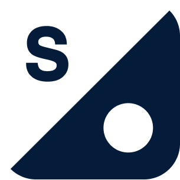

## What is FEDn?
FEDn is an open-source, modular and ML-framework agnostic framework for Federated Machine Learning (FedML) developed and maintained by Scaleout Systems. FEDn enables highly scalable cross-silo and cross-device use-cases over *FEDn networks*.   
  
## Core Features

FEDn lets you seamlessly go from local development of a federated model in a pseudo-distributed sandbox to live production deployments in distributed, heterogeneous environments. Three key design objectives are guiding the project: 

### A ML-framework agnostic black-box design
Client model updates and model validations are treated as black-box computations. This means that it is possible to support virtually any ML model type or framework. Support for Keras and PyTorch artificial neural network models are available out-of-the-box, and support for many other model types, including select models from SKLearn, are in active development. A developer follows a structured design pattern to implement clients and there is a lot of flexibility in the toolchains used.  

### Horizontally scalable through a tiered aggregation scheme 
FEDn is designed to allow for flexible and easy horizontal scaling to handle growing numbers of clients and to meet latency and throughput requirements. This is achieved by a tiered architecture where multiple independent combiners divide up the work to coordinate client updates and aggregation. Recent benchmarks show high performance both for thousands of clients in a cross-device setting and for 40 clients with large model updates (1GB) in a cross-silo setting, see https://arxiv.org/abs/2103.00148. 

### Built for real-world distributed computing scenarios 
FEDn is built groud up to support real-world, production deployments in the distributed cloud. FEDn relies on proven best-practices in distributed computing and incorporates enterprise security features. A central assumption is that data clients should not have to expose any ingress ports.  

More details about architecture and implementation can be found in the [Documentation](https://scaleoutsystems.github.io/fedn/#/architecture). 

## Getting started 

The easiest way to start with FEDn is to use the provided docker-compose templates to launch a pseudo-distributed environment consisting of one Reducer, one Combiner, and a few Clients. Together with the supporting storage and database services this makes up a minimal system for developing a federated model and learning the FEDn architecture. FEDn projects are templated projects that contain the user-provided model application components needed for federated training, referred to as the *compute package*. We bundle two such test projects in the 'test' folder, and many more are available in external repositories. These projects can be used as templates for creating your own custom federated model. 

Clone the repository (make sure to use git-lfs!) and follow these steps:

### Pseudo-distributed deployment
We provide docker-compose templates for a minimal standalone, pseudo-distributed Docker deployment, useful for local testing and development on a single host machine. 

1. Create a default docker network  

We need to make sure that all services deployed on our single host can communicate on the same docker network. Therefore, our provided docker-compose templates use a default external network 'fedn_default'. First, create this network: 

````bash 
$ docker network create fedn_default
````

2. Deploy the base services (Minio and MongoDB)  

````bash 
$ docker-compose -f config/base-services.yaml -f config/private-network.yaml up 
````

Make sure you can access the following services before proceeding to the next steps: 
 - Minio: http://localhost:9000
 - Mongo Express: http://localhost:8081
 
3. Start the Reducer  

Copy the settings config file for the reducer, 'config/settings-reducer.yaml.template' to 'config/settings-reducer.yaml'. You do not need to make any changes to this file to run the sandbox. To start the reducer service:

````bash 
$ docker-compose -f config/reducer.yaml -f config/private-network.yaml up 
````

4. Start a combiner  

Copy the settings config file for the reducer, 'config/settings-combiner.yaml.template' to 'config/settings-combiner.yaml'. You do not need to make any changes to this file to run the sandbox. To start the combiner service and attach it to the reducer:

````bash 
$ docker-compose -f config/combiner.yaml -f config/private-network.yaml up 
````

Make sure that you can access the Reducer UI at https://localhost:8090 and that the combiner is up and running before proceeding to the next step. You should see the combiner listed on https://localhost:8090/network. 

### Train a federated model
Training a federated model on the FEDn network involves uploading a compute package (containing the code that will be distributed to clients), seeding the federated model with a base model (untrained or pre-trained), and then attaching clients to the network. Follow the instruction here to set the environment up to train a model for digits classification using the MNIST dataset: 

https://github.com/scaleoutsystems/fedn/blob/master/test/mnist-keras/README.md

#### Updating/changing the compute package and/or the seed model
By design, it is not possible to simply delete the compute package to reset the model -  this is a security constraint enforced to not allow for arbitrary code  replacement in an already configured federation. To restart and reseed the alliance in development mode navigate to MongoExpress (http://localhost:8081), log in (credentials are found/set in config/base-services.yaml) and delete the entire collection 'fedn-test-network', then restart all services.

## Fully distributed deployment
The deployment, sizing of nodes, and tuning of a FEDn network in production depends heavily on the use case (cross-silo, cross-device, etc), the size of model updates, on the available infrastructure, and on the strategy to provide end-to-end security. We provide instructions for a fully distributed reference deployment here: [Distributed deployment](https://scaleoutsystems.github.io/fedn/#/deployment). 

## Using FEDn in Scaleout Studio 
[STACKn](https://github.com/scaleoutsystems/stackn), Scaleout's cloud native (Fed)MLOps platform helps a user set up, monitor and manage FEDn networks in Kubernetes as 'Apps' deployed from a WebUI. Scaleout Studio is a hosted SaaS intended to accelerate development of Decentralized AI applications, and provides useful functionality such as Jupyter Labs, storage managmement, and model serving for the federated model using e.g. Tensorflow Serving, TorchServe, MLflow or custom serving. End-to-end example here: https://www.youtube.com/watch?v=-a_nIzkSumI

- Sign up for private-beta access at https://scaleoutsystems.com/.   
- [Deploy STACKn on your own infrastructure] (https://github.com/scaleoutsystems/stackn) 
    

## Where to go from here
Additional example projects/clients:

- PyTorch version of the MNIST getting-started example in test/mnist-pytorch
- Sentiment analysis with a Keras CNN-lstm trained on the IMDB dataset (cross-silo): https://github.com/scaleoutsystems/FEDn-client-imdb-keras 
- Sentiment analysis with a PyTorch CNN trained on the IMDB dataset (cross-silo): https://github.com/scaleoutsystems/FEDn-client-imdb-pytorch.git 
- VGG16 trained on cifar-10 with a PyTorch client (cross-silo): https://github.com/scaleoutsystems/FEDn-client-cifar10-pytorch 
- Human activity recognition with a Keras CNN based on the casa dataset (cross-device): https://github.com/scaleoutsystems/FEDn-client-casa-keras 
- Fraud detection with a Keras auto-encoder (ANN encoder): https://github.com/Li-Ju666/FEDn-client-fraud_keras  
 
## Community support 
Join the [Scaleout Discord Server](https://discord.gg/KMg4VwszAd) to engage with other users and developers. If you have a bug report or a feature request, start a ticket directly here on GitHub. 

## Commercial support
Scaleout offers flexible support agreements, reach out at (https://scaleoutsystems.com) to inquire about Enterprise support.

## Making contributions
All pull requests will be considered and are much appreciated. Reach out to one of the maintainers if you are interested in making contributions, and we will help you find a good first issue to get you started. 

For development, it is convenient to use the docker-compose templates config/reducer-dev.yaml and config/combiner-dev.yaml. These files will let you conveniently rebuild the reducer and combiner images with the current local version of the fedn source tree instead of the latest stable release. You might also want to use a Dockerfile for the client that installs fedn from your local clone of FEDn, alternatively mounts the source. 

## Organizational collaborators, contributors and supporters 
  

## License
FEDn is licensed under Apache-2.0 (see LICENSE file for full information).
