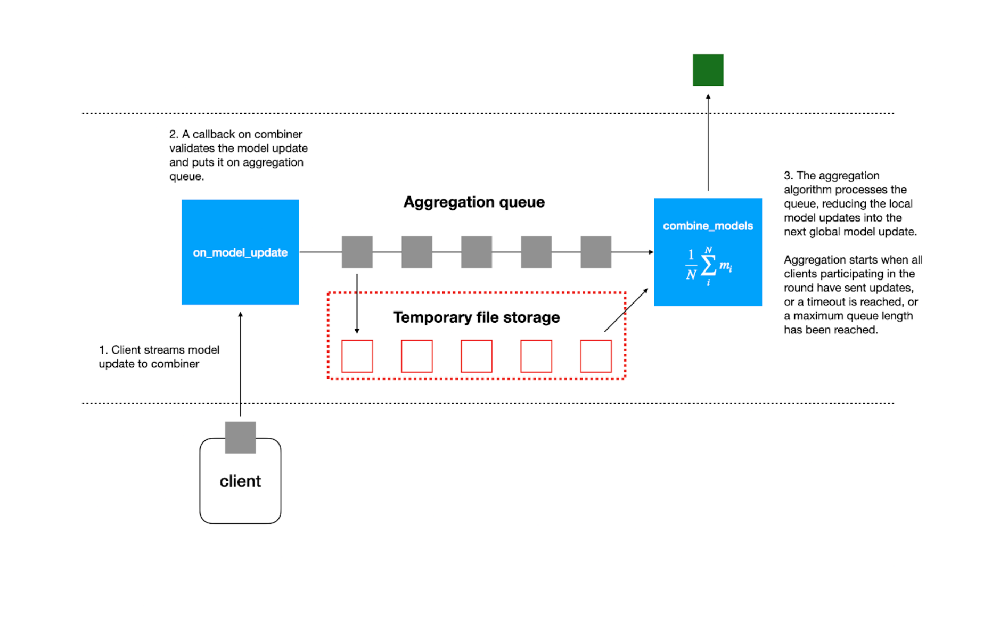

.. _agg-label:

Aggregators
===========

Overview
---------
Aggregators are responsible for combining client model updates into a combiner-level global model. 
During a training session, the combiners will instantiate an Aggregator and use it to process the incoming model updates from clients.

The figure above illustrates the overall workflow. When a client completes a model update, the model parameters are streamed to the combiner, 
and a model update message is sent. The model parameters are saved to disk at a configurable storage location within the combiner to prevent exhausting RAM. 
As multiple clients submit updates, the aggregation queue accumulates. Once specific criteria are met, the combiner begins processing 
the queue, aggregating models according to the specifics of the scheme (e.g., FedAvg, FedAdam).

Using built-in Aggregators
--------------------------

Scaleout Edge supports the following aggregation algorithms: 

- FedAvg (default)
- FedAdam (FedOpt)
- FedYogi (FedOpt)
- FedAdaGrad (FedOpt)

The implementation of the methods from the FedOpt family follows the implemenation in this paper: https://arxiv.org/pdf/2003.00295.pdf 

Training sessions can be configured to use a given aggregator. For example, to use FedAdam:

.. code:: python

   session_config = {
                    "helper": "numpyhelper",
                    "id": "experiment_fedadam",
                    "aggregator": "fedopt",
                    "aggregator_kwargs": {
                        "serveropt": "adam",
                        "learning_rate": 1e-2,
                        "beta1": 0.9,
                        "beta2": 0.99,
                        "tau": 1e-4
                        },
                    "rounds": 10
                 }

   result_fedadam = client.start_session(**session_config)

.. note:: 

   The FedOpt family of methods use server-side momentum. Scaleout Edge resets the aggregator for each new session. 
   This means that the history will will also be reset, i.e. the momentum terms will be forgotten. 
   When using FedAdam, FedYogi and FedAdaGrad, the user needs to strike a 
   balance between the number of rounds in the session from a convergence and utility perspective.  

.. note:: 

   The parameter ``aggregator_kwargs`` are hyperparameters for the FedOpt family aggregators. The
   data types for these parameters (str, float) are validated by the aggregator and an error 
   will be issued if passing parameter values of incompatible type. All hyperparameters are 
   given above for completeness. It is primarily the ``learning_rate`` that will require tuning.

Several additional parameters that guide general behavior of the aggregation flow can be configured: 

- Round timeout: The maximal time the combiner waits before processing the update queue.  
- Buffer size: The maximal allowed length of the queue before processing it.
- Whether to retain or delete model update files after they have been processed (default is to delete them)

Implement own Aggregators
-------------------------

Scaleout Edge supports a flexible architecture that allows developers to implement custom aggregation logic beyond the built-in options.
To define and register your own aggregator, you should use the server functions interface, where aggregation behavior can be customized to suit specific research or production needs.

For detailed instructions and examples on how to implement new aggregators, see the section on :ref:`server-functions`.

.. meta::
   :description lang=en:
      Aggregators are responsible for combining client model updates into a combiner-level global model.
   :keywords: Federated Learning, Aggregators, Federated Learning Framework, Federated Learning Platform, FEDn, Scaleout Systems, Scaleout Edge
