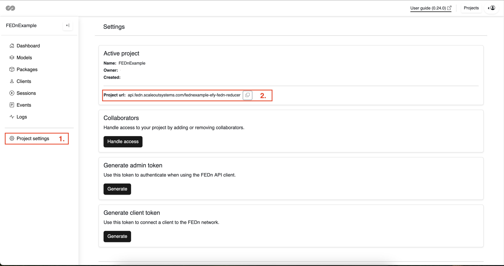

.. _apiclient-label:

Using the API Client
====================

Scaleout Edge comes with an *APIClient* - a Python3 library that is used to interact with your project programmatically. 

This guide assumes that the user has aleady taken the :ref:`quickstart-label` tutorial. If this is not the case, please start there to learn how to set up a Scaleout Edge project and learn 
to connect clients. In this guide we will build on that same PyTorch example (MNIST), showing how to use the APIClient to control training sessions, use different aggregators, and to retrieve models and metrics. 

**Installation**

The APIClient is available as a Python package on PyPI, and can be installed using pip:

.. code-block:: bash
   
   $ pip install scaleout

**Connect the APIClient to the Scaleout Edge project**

To access the API you need the URL to the controller-host, as well as an admin API token. You 
obtain these from your Scaleout Edge project. Navigate to your "Project settings" and copy the "Project url", this is the controller host address:

To obtain an admin API token press "Generate" in the "Generate Admin token" section and copy the token:

To initalize the connection to the Scaleout REST API: 

.. code-block:: python

   >>> from scaleout import APIClient
   >>> client = APIClient(host="<controller-host>", token="<access-token>", secure=True, verify=True)

Alternatively, the access token can be sourced from an environment variable. 

.. code-block:: bash

   $ export SCALEOUT_AUTH_TOKEN=<access-token>

Then passing a token as an argument is not required. 

.. code-block:: python

   >>> from scaleout import APIClient
   >>> client = APIClient(host="<controller-host>", secure=True, verify=True)

We are now ready to work with the API. 

We here assume that you have worked through steps 1-2 in the quisktart tutorial, i.e. that you have created the compute package and seed model on your local machine. 
In the next step, we will use the API to upload these objects to the Scaleout Edge project (corresponding to step 3 in the quickstart tutorial).  

**Set the active compute package and seed model**

To set the active compute package in the Scaleout Edge Project: 

.. code:: python

   >>> client.set_active_package("package.tgz", helper="numpyhelper", name="my-package")
   >>> client.set_active_model("seed.npz")

**Start a training session**

Once the active package and seed model are set, you can connect clients to the network and start training models. To run a training session
using the default aggregator (FedAvg):

.. code:: python

   >>> ...
   >>> client.start_session(name="test-session", rounds=3)
   # Wait for training to complete, when controller is idle:
   >>> client.get_controller_status()
   # Show model trail:
   >>> models = client.get_model_trail()
   # Show performance of latest global model:
   >>> model_id = models[-1]['model']
   >>> validations = client.get_validations(model_id=model_id)

You can follow the progress of the training in the Scaleout Edge UI. 

To run a session using the FedAdam aggregator using custom hyperparamters: 

.. code-block:: python

   >>> session_name = "experiment_fedadam"
   # Use the seed model which is the first model in the model trail
   >>> initial_model = models[0]

   >>> session_config = {
                     "helper": "numpyhelper",
                     "name": session_name,
                     "aggregator": "fedopt",
                     "aggregator_kwargs": {
                           "serveropt": "adam",
                           "learning_rate": 1e-2,
                           "beta1": 0.9,
                           "beta2": 0.99,
                           "tau": 1e-4
                           },
                     "model_id": initial_model['model'],
                     "rounds": 10
                  }

   >>> result_fedadam = client.start_session(**session_config)

**Download a global model**

To download a global model and write it to file:

.. code:: python

   >>> ...
   >>> client.download_model("<model-id>", path="model.npz")

**List data**

Other than starting training sessions, the APIClient can be used to get data from the network, such as sessions, models etc. All entities are represented and they all work in a similar fashion.

* get_*() - (plural) list all entities of a specific type
* get_*(id=<id-of-entity>) - get a specific entity

Entities represented in the APIClient are:

* clients
* combiners
* models
* packages
* rounds
* sessions
* statuses
* validations

To list all sessions: 
.. code-block:: python
   
   >>> sessions = client.get_sessions()

To get a specific session:

.. code-block:: python
   
   >>> session = client.get_session(id="session_id")

For more information on how to use the APIClient, see the :py:mod:`scaleout-client.scaleout.network.api.client`.  
There is also a collection of Jupyter Notebooks showcasing more advanced use of the API, including how to work with other built-in aggregators and how to automate hyperparameter tuning:
 
- `API Example <https://github.com/scaleoutsystems/scaleout-client/python/examples/api-tutorials>`_  . 

.. meta::
   :description lang=en:
      Scaleout Edge comes with an APIClient - a Python3 library that can be used to interact with Scaleout Edge programmatically.
   :keywords: Federated Learning, APIClient, Federated Learning Framework, Federated Learning Platform, FEDn, Scaleout Systems, Scaleout Edge
   
