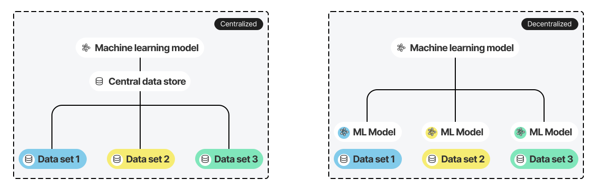

What is Federated Learning? 
===========================

Federated learning (FL) is a decentralized machine learning approach. Instead of collecting data in one place, FL sends the model to where the data is—training happens locally on distributed devices or systems. The results are then aggregated into a single global model, all while keeping raw data private and secure.

Traditional machine learning
-----------------------------

Traditional machine learning is centralized. Data from various sources is collected into a single location - typically a cloud platform or data center — and training models on that combined dataset.

This method works well in many cases, but it's increasingly limited. The rapid growth of connected devices, sensors and distributed data sources has led to an exponential increase in data volume and complexity. Meanwhile, privacy regulations and security concerns make centralizing this data difficult and expensive.

Often, the data needed for training exists across many devices, organizations, or locations. Centralizing it is challenging due to privacy risks and high transfer costs.

How federated learning works
-----------------------------

In federated learning, models are trained across multiple devices or servers (called client nodes) without moving the data. Here's how it works:

1. **Initialize the global model -** A central server starts with an initial global model—like a neural network or decision tree.
2. **Sending to clients -** The model's parameters are sent to selected clients. Each client keeps its local dataset private.
3. **Local training -** Each client updates the model using its local data. This training is repeated in several rounds — not to completion.
4. **Combining the updates -** The updated models from each client are sent back to the central server, where they are combined. 

This cycle repeats until the global model reaches the desired accuracy.

The Scaleout Edge framework 
---------------------------

Scaleout Edge is a federated learning framework focused on security, scalability, and ease of use. It supports the full development lifecycle—from early experiments to production deployments—with minimal code changes. Key design goals include:

-  **Minimal server-side complexity for the end-user**. Scaleout Edge handles orchestration, providing a UI, REST API, and Python interface for managing experiments and tracking metrics in real time.

-  **Secure by design.** Clients never need to open inbound ports. gRPC, token-based authentication (JWT) and RBAC provides flexible and secure integration. 

-  **ML-framework agnostic**. A black-box client-side architecture lets data scientists use any ML framework. 

-  **Cloud native.** Deploy on public cloud, private cloud, or on-prem infrastructure.

-  **Scalability and resilience.** Multiple combiners can balance load. Scaleout Edge handles failures in all critical components and manages intermittent client-connections. 

-  **Developer and DevOps friendly.** Logging, tracing, and plugin architecture simplify monitoring, debugging, and extending the system.  

Features
--------

Federated learning: 

- Tiered federated learning architecture enabling massive scalability and resilience. 
- Support for any ML framework (examples for PyTorch, Tensforflow/Keras and Scikit-learn)
- Extendable via a plug-in architecture (aggregators, load balancers, object storage backends, databases  etc.)
- Built-in federated algorithms (FedAvg, FedAdam, FedYogi, FedAdaGrad, etc.)
- UI, CLI and Python API.
- Implement clients in any language (Python, C++, Kotlin etc.)
- No inbound ports required on client devices

From development to FL in production: 

-  Secure deployment of server-side / control-plane on Kubernetes.
-  UI with dashboards for orchestrating FL experiments and for visualizing results
-  Team features - collaborate with other users in shared project workspaces. 
-  Features for the trusted-third party: Manage access to the FL network, FL clients and training progress.
-  REST API for handling experiments/jobs. 
-  View and export logging and tracing information. 
-  Public cloud, dedicated cloud and on-premise deployment options.

Available client APIs:

- Python client (`Scaleout Edge C++ client <https://github.com/scaleoutsystems/scaleout-client/python>`__)
- C++ client (`Scaleout Edge C++ client <https://github.com/scaleoutsystems/scaleout-client/cpp>`__)
- Android Kotlin client (`Scaleout Edge Kotlin client <https://github.com/scaleoutsystems/scaleout-client/android>`__)

Support
--------

Community support in available in our `Discord
server <https://discord.gg/KMg4VwszAd>`__.

For professionals / Enteprise, we offer `Dedicated support <https://www.scaleoutsystems.com/start#pricing>`__.

.. meta::
    :description lang=en:
        Federated learning (FL) is a decentralized approach to machine learning. Instead of moving the data, FL moves the computation to where the data is.
    :keywords: Federated Learning, Machine Learning, What is federated machine learning, Federated Learning Framework, Federated Learning Platform
    :og:title: What is Federated Learning?
    :og:description: Federated learning is a decentralized approach that tackles the issues of centralized machine learning by allowing models to be trained on data distributed across various locations without moving the data.
    :og:url: https://docs.scaleoutsystems.com/en/stable/introduction.html
    :og:type: website