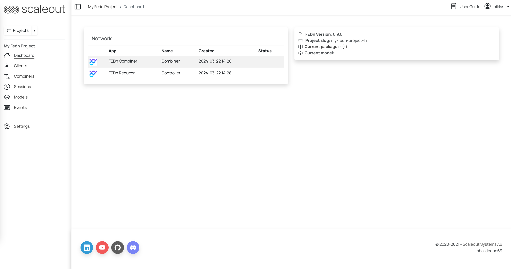

.. _quickstart-label:

Getting started with FEDn
=========================

.. note::
   This tutorial is a quickstart guide to FEDn based on a pre-made FEDn Project. It is designed to serve as a starting point for new developers. 
   To learn how to develop your own project from scratch, see :ref:`projects-label`. 
   
**Prerequisites**

-  `Python >=3.8, <=3.12 <https://www.python.org/downloads>`__
-  `A FEDn Studio account <https://fedn.scaleoutsystems.com/signup>`__ 

1. Start the server 
--------------------

The first step is to start the server side (aggregator, controller). We do this by setting up a new Project in FEDn Studio.  
Start by creating an account in Studio: `fedn.scaleoutsystems.com/signup <https://fedn.scaleoutsystems.com/signup/>`_.

Logged into Studio, create a new project by clicking  on the "New Project" button in the top right corner of the screen.
You will see a Studio project similar to the image below. The Studio project provides a secure and managed deployment of all the necessary server side components. 

1.5 Set up a Virtual environment (Recommended)
----------------------------------------------

Before installing FEDn using pip, we recommend creating a virtual environment. This helps isolate dependencies and avoids conflicts with other Python projects on your machine.

You can set up and activate a virtual environment using the following steps:

**Using venv** (Python's built-in module for virtual environments)

.. tabs::

    .. code-tab:: bash
         :caption: Unix/MacOS

         python3 -m venv fedn_env
         source fedn_env/bin/activate

    .. code-tab:: bash
         :caption: Windows (Powershell)

         python -m venv fedn_env
         .\fedn_env\Scripts\Activate

After activating the virtual environment, you can proceed with the next steps.

2. Prepare the clients and define the global model
---------------------------------------------------

Next, we will prepare and package the ML code to be executed by each client and create a first version of the global model (seed model). 
We will work with one of the pre-defined projects in the FEDn repository, ``mnist-pytorch``. 

First install the FEDn API on your local machine (client): 

**Using pip**

On you local machine/client, install the FEDn package using pip:

.. code-block:: bash

   pip install fedn

**From source**

Clone the FEDn repository and install the package:

.. code-block:: bash

   git clone https://github.com/scaleoutsystems/fedn.git
   cd fedn
   pip install .

It is recommended to use a virtual environment when installing FEDn.

.. _package-creation:

**Create the compute package and seed model**

In order to train a federated model using FEDn, your Studio project needs to be initialized with a ``compute package`` and a ``seed model``. The compute package is a code bundle containing the 
code used by the client to execute local training and local validation. The seed model is a first version of the global model. 
For a detailed explaination of the compute package and seed model, see this guide: :ref:`projects-label`

To work through this quick start you need a local copy of the ``mnist-pytorch`` example project contained in the main FEDn Git repository. 
Clone the repository using the following command, if you didn't already do it in the previous step:

.. code-block:: bash

   git clone https://github.com/scaleoutsystems/fedn.git

Navigate to the ``fedn/examples/mnist-pytorch`` folder. The compute package is located in the folder ``client``.

Create a compute package: 

.. code-block::

   fedn package create --path client

This will create a file called ``package.tgz`` in the root of the project.

Next, create the seed model: 

.. code-block::

   fedn run build --path client

This will create a file called ``seed.npz`` in the root of the project. 

.. note::
   This example automatically creates the runtime environment for the compute package using Virtualenv. 
   When you first exectue the above commands, FEDn will build a venv, and this takes 
   a bit of time. For more information on the various options to manage the environement, see :ref:`projects-label`. 

Next will now upload these files to your Studio project.  

3. Initialize the server-side
------------------------------
The next step is to initialize the server side with the client code and the initial global model. In the Studio UI,

#. Navigate to the project you created in step 1 and click on the "Sessions" tab. 
#. Click on the "New Session" button. 
#. Under the "Compute package" tab, select a name and upload the generated package file. 
#. Under the "Seed model" tab, upload the generated seed file:

.. image:: img/upload_package.png

Continue to step 4 before starting the session. The uploaded package and seed files are saved.

4. Start clients
-----------------

Now we are ready to start FEDn clients on your local machine. There are two steps involved: 

#. Register a new client in your Studio project, issuing an access token. 
#. Start up a client process on your local host (using the token to connect securely)  

**Generate an access token for the client (in Studio)**

Each local client needs an access token in order to connect securely to the FEDn server. These tokens are issued from your Studio Project. 

#. Go to the 'Clients' tab and click 'Connect client'. 
#. Download a client configuration file and save it to the root of the ``examples/mnist-pytorch`` folder. 
#. Rename the file to 'client.yaml'. 

**Start the client (on your local machine)** 

The default training and test data for this particular example (mnist-pytorch) is for convenience downloaded and split automatically by the client when it starts up. 
The number of splits and which split to use by a client can be controlled via the environment variables ``FEDN_NUM_DATA_SPLITS`` and ``FEDN_DATA_PATH``.

Start a client (using a 10-split and the 1st partition) by running the following commands:

.. tabs::

    .. code-tab:: bash
         :caption: Unix/MacOS

         export FEDN_PACKAGE_EXTRACT_DIR=package
         export FEDN_NUM_DATA_SPLITS=10
         export FEDN_DATA_PATH=./data/clients/1/mnist.pt
         fedn run client -in client.yaml --secure=True --force-ssl

    .. code-tab:: bash
         :caption: Windows (Powershell)

         $env:FEDN_PACKAGE_EXTRACT_DIR=".\package"
         $env:FEDN_NUM_DATA_SPLITS=10
         $env:FEDN_DATA_PATH=".\data\clients\1\mnist.pt"
         fedn run client -in client.yaml --secure=True --force-ssl

Repeat these two steps (generate an access token and start a local client) for the number of clients you want to use.
A normal laptop should be able to handle several clients for this example. Remember to use different partitions for each client, by changing the number in the ``FEDN_DATA_PATH`` variable. 

5. Train the global model 
-----------------------------

With clients connected, we are now ready to train the global model. This can be done using either the Studio dashboard or the Python API. In FEDn, training is organised 
in Sessions. One training session consists of a configurable number of training rounds (local model updates and aggregation).  

In Studio, 

#. Click on the "Sessions" link, then the "New session" button in the upper right corner. 
#. Click the "Start session" tab and enter your desirable settings (the default settings are good for this example).
#. Hit the "Start run" button.

In the terminal where your are running your client you should now see some activity. When a round is completed, you can see the results on the "Models" page.

**Watch real-time updates of training progress**

Once a training session is started, you can monitor the progress by clicking the drop-down button for the active Sessions and then clicking on the "View session" button. The session page will show 
metrics related to the training progress (accuracy, loss etc), as well as performance data such as total round times and individual client training times. A list of models in the session is updated as soon as new models are generated. 
To get more information about a particular model, navigate to the model page by clicking the model name. From the model page you can download the model weights and get validation metrics.

.. image:: img/studio_model_overview.png

.. _studio-api:

Congratulations, you have now completed your first federated training session with FEDn! Below you find additional information that can
be useful as you progress in your federated learning journey.

**Downloading global model updates**  

.. note::
   In FEDn Studio, you can access global model updates by going to the 'Models' or 'Sessions' tab. Here you can download model updates, metrics (as csv) and view the model trail.

**Where to go from here?**

With you first FEDn federated project set up, we suggest that you take a closer look at how a FEDn project is structured
to learn how to develop your own FEDn projects:

:ref:`projects-label`

In this tutorial we relied on the UI for running training sessions and retrieving models and results. 
The Python APIClient provides a flexible alternative, with additional functionality exposed, 
including the use of different aggregators. Learn how to use the APIClient here: 

:ref:`apiclient-label`

Study the architecture overview to learn more about how FEDn is designed and works under the hood: 

:ref:`architecture-label`

For developers looking to customize FEDn and develop own aggregators, check out the local development guide
to learn how to set up an all-in-one development environment using Docker and docker-compose:

:ref:`developer-label`

.. meta::
   :description lang=en: This tutorial is a quickstart guide to FEDn based on a pre-made FEDn Project. It is designed to serve as a starting point for new developers. The first step is to start the server side (aggregator, controller). We do this by setting up a new Project in FEDn Studio.
   :keywords: Getting started with Federated Learning, Federated Learning, Federated Learning Framework, Federated Learning Platform
   :robots: index, follow
   :og:title: Getting started with FEDn
   :og:description: This tutorial is a quickstart guide to FEDn based on a pre-made FEDn Project. It is designed to serve as a starting point for new developers.
   :og:image: https://fedn.scaleoutsystems.com/static/images/scaleout_black.png
   :og:url: https://fedn.scaleoutsystems.com/docs/quickstart.html
   :og:type: website