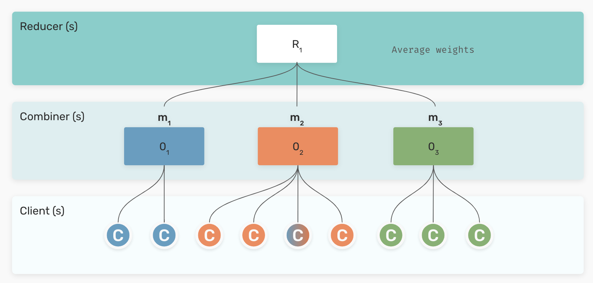

Architecture overview
=====================

Constructing a federated model with FEDn amounts to a) specifying the details of the client-side training code and data integrations, and b) deploying the reducer-combiner network. A FEDn network, as illustrated in the picture below, is made up of three main components: the *Reducer*, one or more *Combiners*, and a number of *Clients*. The combiner network forms the backbone of the FedML orchestration mechanism, while the Reducer provides discovery services and provides controls to coordinate training over the combiner network. By horizontally scaling the combiner network, one can meet the needs of a growing number of clients.  
 
.. image:: img/overview.png
   :alt: FEDn network
   :width: 100%
   :align: center

Main components
---------------

Client
......

A Client is a data node, holding private data and connecting to a Combiner to receive model update requests and model validation requests during training rounds. Importantly, clients do not require any open ingress ports. A client receives the code to be executed from the Reducer upon connecting to the network, and thus they only need to be configured prior to connection to read the local datasets during training and validation. Python3 client implementation is provided out of the box, and it is possible to write clients in a variety of languages to target different software and hardware requirements.  

Combiner
........

A combiner is an actor whose main role is to orchestrate and aggregate model updates from a number of clients during a training round. When and how to trigger such orchestration rounds are specified in the overall *compute plan* laid out by the Reducer. Each combiner in the network runs an independent gRPC server, providing RPCs for interacting with the alliance subsystem it controls. Hence, the total number of clients that can be accommodated in a FEDn network is proportional to the number of active combiners in the FEDn network. Combiners can be deployed anywhere, e.g. in a cloud or on a fog node to provide aggregation services near the cloud edge. 

Reducer
.......

The reducer fills three main roles in the FEDn network: 1.) it lays out the overall, global training strategy and communicates that to the combiner network. It also dictates the strategy to aggregate model updates from individual combiners into a single global model, 2.) it handles global state and maintains the *model trail* - an immutable trail of global model updates uniquely defining the FedML training timeline, and  3.) it provides discovery services, mediating connections between clients and combiners. For this purpose, the Reducer exposes a standard REST API. 

Services and communication
--------------------------

The figure below provides a logical architecture view of the services provided by each agent and how they interact. 

.. image:: img/FEDn-arch-overview.png
   :alt: FEDn architecture overview
   :width: 100%
   :align: center

Control flows and algorithms
----------------------------

FEDn is designed to allow customization of the FedML algorithm, following a specified pattern, or programming model. Model aggregation happens on two levels in the system. First, each Combiner can be configured with a custom orchestration and aggregation implementation, that reduces model updates from Clients into a single, *combiner level* model. Then, a configurable aggregation protocol on the Reducer level is responsible for combining the combiner-level models into a global model. By varying the aggregation schemes on the two levels in the system, many different possible outcomes can be achieved. Good staring configurations are provided out-of-the-box to help the user get started. 

Hierarchical Federated Averaging
................................

The currently implemented default scheme uses a local SGD strategy on the Combiner level aggregation and a simple average of models on the reducer level. This results in a highly horizontally scalable FedAvg scheme. The strategy works well with most artificial neural network (ANNs) models, and can in general be applied to models where it is possible and makes sense to form mean values of model parameters (for example SVMs). Additional FedML training protocols, including support for various types of federated ensemble models, are in active development.  

