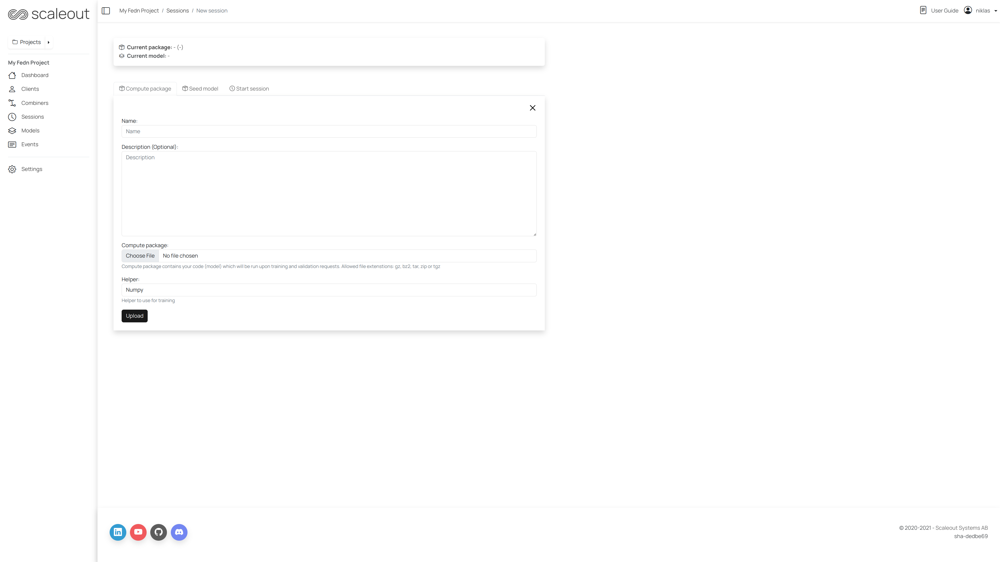

Studio
===============

FEDn Studio is a web-based tool for managing and monitoring federated learning experiments. It provides a user-friendly interface for creating and managing federated learning experiments, monitoring the progress of training, and visualizing the results.

Getting started
---------------

Before you can start using Studio, you will need an account. Head over to `studio.scaleoutsystems.com/signup <https://studio.scaleoutsystems.com/signup/>`_  and sign up today!

Create a project
----------------

Start by creating a new project. A project is a container for your federated learning experiments. You can create multiple projects to organize your experiments. A project can be shared with other users, allowing you to collaborate on experiments.

1. Click on the "New Project" button in the top right corner of the screen.
2. Continue by clicking the "Create button". The FEDn template contains all the services necessary to start a federation.
3. Enter the project name (mandatory). The project description is optional.
4. Click the "Create" button to create the project.

Project overview
----------------

Once you have created a project, you can find it via the sidebar link Projects. Here you will find the list of all your projects. When inside a project you can see the following tabs in the sidebar:

1. **Dashboard**: The dashboard provides an overview of the project. The controller and combiner(s) are listed under "Network". This is also where you can find the current FEDn version and get the option to upgrade to a newer version if available
2. **Clients**: management of client configurations and a list of current clients. Observe that this feature does not deploy clients, instead it configures a client config that contains a unique token which is required to connect to the reducer and the combiner
3. **Combiners**: a list of combiners. Observe number of active clients for each combiner
4. **Sessions**: a list of sessions with related models. Configure and start a new session. Upload compute package and seed model, set number of rounds, timeout limit etc
5. **Models**: a list of models generated across sessions
6. **Events**: a log of events from the combiner and the clients of the federated network
7. **Settings**: project settings, including the option to delete the project and give access to other users

Configure and attach clients
----------------------------

This step is very similar to how connecting a client to a local FEDn instance (:doc:`quickstart`). The main difference is that the client needs an authorization token to connect to a federation hosted on FEDn Studio. These are the steps to configure and attach a client to a project:

In order to generate some data for training, on your local machine, navigate to the mnist-pytorch example:

.. code-block:: bash

    cd fedn/examples/mnist-pytorch

Generate files
~~~~~~~~~~~~~~

Run the following commands:

.. code-block:: bash

    bin/init_venv.sh
    bin/get_data
    bin/split_data
    bin/build.sh

This commands will generate some training data and two files: package.tgz and seed.npz. The first is a compute package file and the second is a model file that can be used as the inital seed model. (For a more detailed explanation of the commands, see the :doc:`quickstart`)

Upload files
~~~~~~~~~~~~

In the Studio UI, navigate to the project you created and click on the "Sessions" tab. Click on the "New Session" button. Under the Compute package tab, select a name and upload the generated package file. Under the Seed model tab upload the generated seed file:

Connect client
~~~~~~~~~~~~~~

Navigate to clients and click on the "Download config" button. This downloads a client config file. Place this file in the mnist-pytorch directory on your local machine. Rename the file to client.yaml. Then edit it to set the name of the client.

Later, in Studio, click on the "Connect client" button.
This will diplay the the docker command to attach the client. Run the command from the mnist-pytorch directory on your local machine. The command should look similar to this (please note that the version number may differ and should correspond to the FEDn version used in the project):

.. code-block:: bash

      docker run \
        -v $PWD/client.yaml:/app/client.yaml \
        -v $PWD/data/clients/1:/var/data \
        -e ENTRYPOINT_OPTS=--data_path=/var/data/mnist.pt \
        ghcr.io/scaleoutsystems/fedn/fedn:0.9.0-mnist-pytorch run client --secure=True --force-ssl -in client.yaml

If the client is successfully connected, you should see the client listed in the "Clients log" list.

Start a session
---------------

In Studio click on the Sessions link, then the "New session" button in the upper right corner. Click the Start session tab and enter your desirable settings (or use default) and hit the "Start run" button. In the terminal where your are running your client you should now see some activity. When the round is completed you can see the results in the FEDn Studio ui.

