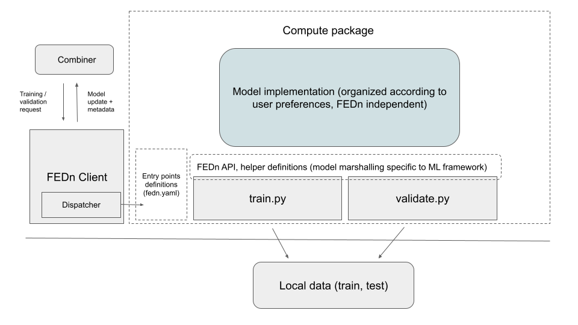
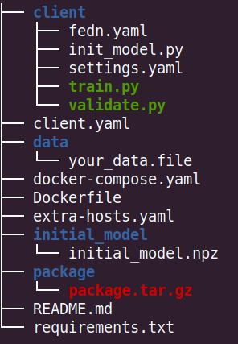
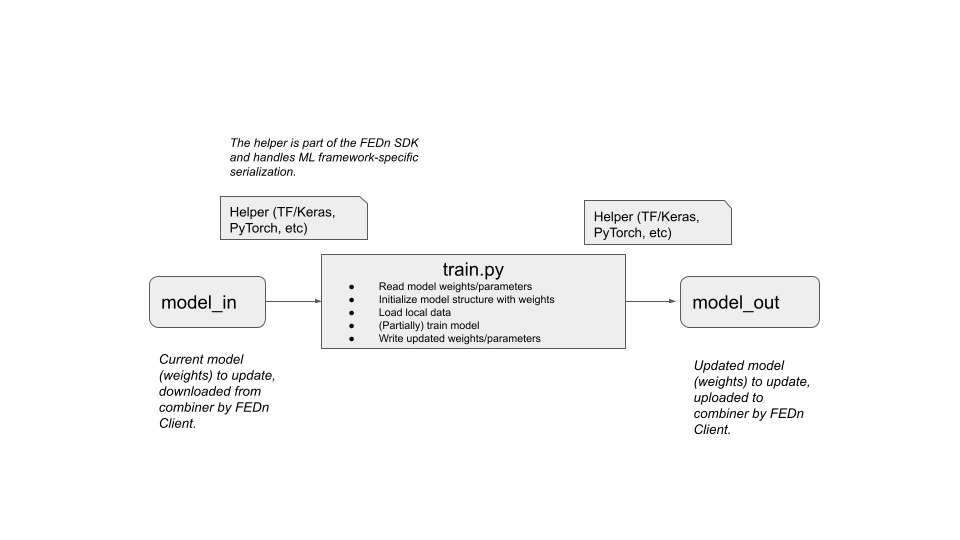

Tutorial: Compute Package
================================================

This tutorial walks you through the key step done by the *model initiator* when setting up a federated project. 
The code for this guideline has been taken from the mnist-keras example provided `here <https://github.com/scaleoutsystems/examples>`_. 
However, some modification to the code has been made for educational purposes.     

The compute package
-----------------------------

The *compute package* is a tar.gz bundle of the code to be executed by each data-provider/client. 
This package is uploaded to the Reducer upon initialization of the FEDN Network (along with the initial model). 
When a client connects to the network, it downloads and unpacks the package locally and are then ready to 
participate in training and/or validation. 

The logic is illustrated in the above figure. When the `FEDn client <https://github.com/scaleoutsystems/fedn/blob/master/fedn/fedn/client.py>`_.  
recieves a model update request from the combiner, it calls upon a Dispatcher that looks up entry point definitions 
in the compute package. These entrypoints define commands executed by the client to update/train or validate a model.

Designing the compute package
------------------------------
We recommend to use the project structure followed by most example projects `here <https://github.com/scaleoutsystems/examples>`_.
In the examples we have roughly the following structure:

The "client" folder is the *compute package* which will become a tar.gz bundle of the code to be executed by 
each data-provider/client. The entry points, mentioned above, are defined in the *fedn.yaml*:

.. code-block:: yaml
    
    entry_points:
        train:
            command: python train.py
        validate:
            command: python validate.py

Where the training entry point has the following logical overview:

The training entry point should be a single-input single-output program, taking as input a model update file 
and writing a model update file (same file format). Staging and upload of these files are handled by the FEDn client. A helper class in the FEDn SDK handled the ML-framework 
specific file serialization and deserialization. The validation entry point acts very similar except we perform validation on the 
*model_in* and outputs a json containing a validation scores (see more below). 

Upon training (model update) requests from the combiner, the client will download the latest (current) global model and *train.py* will be executed with this model update as input. After training / updating completes, the local client will capture the output file and send back the updated model to the combiner. For the local execution this means that the program (in this case train.py) will be executed as:  

.. code-block:: python

   python train.py model_in model_out

A typical *train.py* example can look like this:

.. code-block:: python

    from __future__ import print_function
    import sys
    import yaml

    from data.read_data import read_data

    def train(model,data_path,settings):
        """
        Training function which will be called upon model update requests
        from the combiner

        :param model: The latest global model, see '__main__'
        :type model: User defined
        :param data: Traning data
        :type data: User defined
        :param settings: Hyper-parameters settings
        :type settings: dict
        :return: Trained/updated model
        :rtype: User defined
        """
        print("-- RUNNING TRAINING --", flush=True)

        #CODE TO READ DATA
        
        #EXAMPLE, SOME USER DEFINED FUNCION THAT READS THE TRAINING DATA
        (x_train, y_train) = read_data(data_path, trainset=True)

        #CODE FOR START TRAINING
        #EXAMPLE (Tensoflow)
        model.fit(x_train, y_train, batch_size=settings['batch_size'], epochs=settings['epochs'], verbose=1)

        print("-- TRAINING COMPLETED --", flush=True)
        return model

    if __name__ == '__main__':

        #READ HYPER_PARAMETER SETTINGS FROM YAML FILE
        with open('settings.yaml', 'r') as fh:
            try:
                settings = dict(yaml.safe_load(fh))
            except yaml.YAMLError as e:
                raise(e)

        #CREATE THE SEED MODEL AND UPDATE WITH LATEST WEIGHTS
        #EXAMPLE, USE KERAS HELPER IN FEDN SDK FOR READING WEIGHTS
        from fedn.utils.kerashelper import KerasHelper
        helper = KerasHelper()
        weights = helper.load_model(sys.argv[1])

        #EXAMPLE, A USER DEFINED FUNCTION THAT CONSTRUCTS THE MODEL, E.G THE ARCHITECTURE OF A NEURAL NETWORK
        from models.model import create_seed_model
        model = create_seed_model()
        #EXAMPLE (HOW TO SET WEIGHTS OF A MODEL DIFFERS BETWEEN LIBRARIES)
        model.set_weights(weights)

        #CALL TRAINING FUNCTION AND GET UPDATED MODEL
        model = train(model,'../data/your_data.file',settings)

        #SAVE/SEND MODEL
        #EXAMPLE, USING KERAS HELPER IN FEDN SDK
        helper.save_model(model.get_weights(),sys.argv[2])
        

The format of the input and output files (model updates) are dependent on the ML framework used. A `helper class <https://github.com/scaleoutsystems/fedn/blob/master/fedn/fedn/utils/kerashelper.py>`_. 
defines serializaion and de-serialization of the model updates.
Observe that the functions `create_seed_model <https://github.com/scaleoutsystems/examples/blob/b5876dc42e91b694488351b5dbff0cef3329b7dc/mnist-keras/client/models/mnist_model.py#L13>`_ 
and `read_data <https://github.com/scaleoutsystems/examples/blob/b5876dc42e91b694488351b5dbff0cef3329b7dc/mnist-keras/client/data/read_data.py#L4>`_ are implemented by the user, where the first function 
constructs (compiles) and returns an untrained (seed) model. We then take this model and set the weights to be equal to the current global model recieved
from the commbiner. In the example above we use the Keras helper class to de-serialize those weights and the keras funcion *model.set_weights()* to set the seed model to be equal to the current model. 
We then call the *train* function to first read the training data
(obs. the location of the data can differ depending on if you run the client in a native or containerized environment, in the latter case it's recommend to mount the data to the container, 
the location should then be relative to the mount path) and then start the training.
In this example, training equals fitting the keras model, thus we call *model.fit()* fucntion. 
The *settings.yaml* is for conveniance and is not required but contains the hyper-parameter settings for the local training as key/value pairs.    

For validations it is a requirement that the output is valid json: 

.. code-block:: python

   python validate.py model_in validation.json
 
The Dahboard in the FEDn UI will plot any scalar metric in this json file, but you can include any type in the file assuming that it is valid json. These values can then be obtained (by an athorized user) from the MongoDB database (via Mongo Express, or any query interface or API). Typically, the actual model is defined in a small library, and does not depend on FEDn. An example (based on the keras case) of the *validate.py* is povided below:

.. code-block:: python

    import sys
    from data.read_data import read_data
    import json
    from sklearn import metrics
    import os
    import yaml
    import numpy as np

    def validate(model,data):
        """
        Validation function which will be called upon model validation requests
        from the combiner.

        :param model: The latest global model, see '__main__'
        :type model: User defined
        :param data: The data used for validation, could include both training and test/validation data
        :type data: User defined
        :return: Model scores from the validation
        :rtype: dict
        """
        print("-- RUNNING VALIDATION --", flush=True)

        #CODE TO READ DATA
        
        #EXAMPLE
        (x_train, y_train) = read_data(data, trainset=True)

        #EXAMPLE
        (x_test, y_test) = read_data(data, trainset=False)
        
        try:
            #CODE HERE FOR OBTAINING VALIDATION SCORES 
            
            #EXAMPLE
            model_score = model.evaluate(x_train, y_train, verbose=0)
            model_score_test = model.evaluate(x_test, y_test, verbose=0)
            y_pred = model.predict(x_test)
            y_pred = np.argmax(y_pred, axis=1)
            clf_report = metrics.classification_report(y_test.argmax(axis=-1),y_pred)

        except Exception as e:
            print("failed to validate the model {}".format(e),flush=True)
            raise

        #PUT SCORES AS VALUES FOR CORRESPONDING KEYS (CHANGE VARIABLES):
        report = {
                    "classification_report": clf_report,
                    "training_loss": model_score[0],
                    "training_accuracy": model_score[1],
                    "test_loss": model_score_test[0],
                    "test_accuracy": model_score_test[1],
                }

        print("-- VALIDATION COMPLETE! --", flush=True)
        return report

    if __name__ == '__main__':

        #READS THE LATEST WEIGHTS FROM GLOBAL MODEL (COMBINER)
        
        from fedn.utils.kerashelper import KerasHelper
        helper = KerasHelper()
        weights = helper.load_model(sys.argv[1])

        #CREATE THE SEED MODEL AND UPDATE WITH LATEST WEIGHTS
        from models.model import create_seed_model
        model = create_seed_model()
        #EXAMPLE (HOW TO SET WEIGHTS OF A MODEL DIFFERS BETWEEN LIBRARIES)
        model.set_weights(weights)
        
        #START VALIDATION
        report = validate(model,'../data/your_data.file')

        #SAVE/SEND SCORE REPORT
        with open(sys.argv[2],"w") as fh:
            fh.write(json.dumps(report))

As demonstrated in the code above, the structure is very similar to *train.py*. The main difference is that we perform validation of a current model provided by the combiner instead of training. Again, the *read_data* function is defined by the user. Once, we have optained a validation
*report* as a dictionary we can dump as json (required). Observe that the key/values are arbitrary.

For the initialization of the Reducer, both the compute package and an initial model (weights) are required as individual files. To obtain the initial weights file we can use the fedn helpers to save the seed model to an output file (*init_model.py*):

.. code-block:: python

    from fedn.utils.kerashelper import KerasHelper
    from models.mnist_model import create_seed_model

    if __name__ == '__main__':

        #CREATE INITIAL MODEL, UPLOAD TO REDUCER
        model = create_seed_model()
        outfile_name = "../initial_model/initial_model.npz"

        weights = model.get_weights()
        helper = KerasHelper()
        helper.save_model(weights, outfile_name)

Which will be saved into the *initial_model* folder for convenience. Of course this file can also be a pretrained seed model.
For the compute package we need to compress the *client* folder as .tar.gz file. E.g. using:

.. code-block:: bash

    tar -czvf package.tar.gz client

More on Data access 
-------------------

There are many possible ways to interact with the local dataset. In principle, the only requirement is that the train and validate endpoints are able to correctly 
read and use the data. In practice, it is then necessary to make some assumption on the local environemnt when writing train.py and validate.py. This is best explained 
by looking at the code above. Here we assume that the dataset is present in a file called "your_data.file" in a folder "data" one level up in the file hierarchy relative to 
the exection of train.py. Then, independent on the preferred way to run the client (native, Docker, K8s etc) this structure needs to be maintained for this particular 
compute package. Note however, that there are many ways to accompish this on a local operational level.

Running the client
------------------
We recommend you to test your code before running the client. For example, you can simply test *train.py* and *validate.py* by:

.. code-block:: python

    python train.py ../initial_model/initial_model.npz

Once everything works as expected you can start the Reducer, upload the tar.gz compute package and the initial weights, followed by starting one or many combiners. 
Finally connect a client to the network. Instructions for how to connect clients can be found in the `examples <https://github.com/scaleoutsystems/examples>`_.

