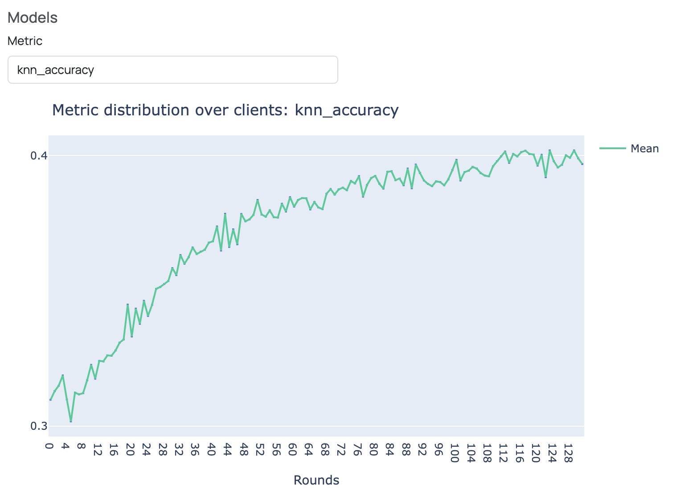

   **Note: If you are new to FEDn, we recommend that you start with the MNIST-Pytorch example instead: https://github.com/scaleoutsystems/fedn/tree/master/examples/mnist-pytorch**

FEDn Project: FedSimSiam on CIFAR-10
------------------------------------

This is an example FEDn Project that trains the federated self-supervised learning algorithm FedSimSiam on 
the CIFAR-10 dataset. CIFAR-10 is a popular benchmark dataset that contains images of 10 different classes, such as cars, dogs, and ships.
In short, FedSimSiam trains an encoder to learn useful feature embeddings for images, without the use of labels. 
After the self-supervised training stage, the resulting encoder can be downloaded and trained for a downstream task (e.g., image classification) via supervised learning on labeled data.
To learn more about self-supervised learning and FedSimSiam, have a look at our blog-post: https://www.scaleoutsystems.com/post/federated-self-supervised-learning-and-autonomous-driving

To run the example, follow the steps below. For a more detailed explanation, follow the Quickstart Tutorial: https://fedn.readthedocs.io/en/stable/quickstart.html

**Note: To be able to run this example, you need to have GPU access.**

Prerequisites
-------------

-  `Python >=3.9, <=3.12 <https://www.python.org/downloads>`__
-  `A project in FEDn Studio  <https://fedn.scaleoutsystems.com/signup>`__   

Creating the compute package and seed model
-------------------------------------------

Install fedn: 

.. code-block::

   pip install fedn

Clone this repository, then locate into this directory:

.. code-block::

   git clone https://github.com/scaleoutsystems/fedn.git
   cd fedn/examples/FedSimSiam

Create the compute package:

.. code-block::

   fedn package create --path client

This creates a file 'package.tgz' in the project folder.

Next, generate the seed model:

.. code-block::

   fedn run build --path client

This will create a model file 'seed.npz' in the root of the project. This step will take a few minutes, depending on hardware and internet connection (builds a virtualenv).  

Running the project on FEDn Studio
----------------------------------

To learn how to set up your FEDn Studio project and connect clients, take the quickstart tutorial: https://fedn.readthedocs.io/en/stable/quickstart.html.

When running the example in FEDn Studio, you can follow the training progress of FedSimSiam under 'Models'. 
After each training round, a kNN classifier is fitted to the feature embeddings of the training images obtained 
by FedSimSiam's encoder and evaluated on the feature embeddings of the test images. 
This is a common method to track FedSimSiam's training progress, 
as FedSimSiam aims to minimize the distance between the embeddings of similar images. 
If training progresses as intended, accuracy increases as the feature embeddings for 
images within the same class are getting closer to each other in the embedding space. 
In the figure below we can see that the kNN accuracy increases over the training rounds, 
indicating that the training of FedSimSiam is proceeding as intended. 

