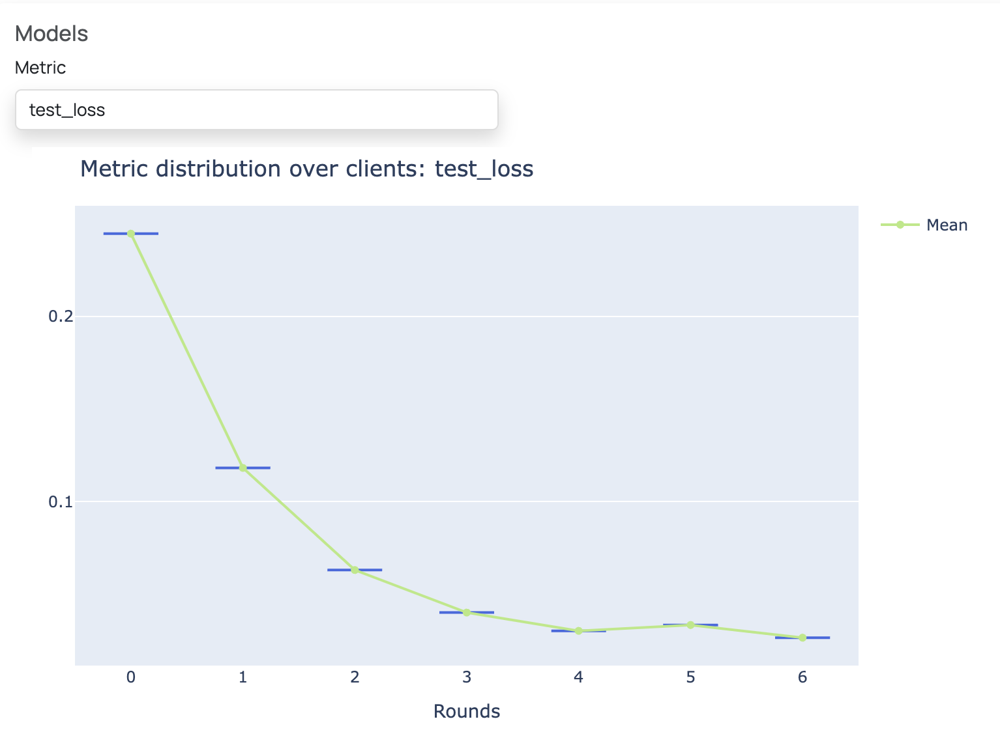

   **Note: If you are new to FEDn, we recommend that you start with the MNIST-Pytorch example instead: https://github.com/scaleoutsystems/fedn/tree/master/examples/mnist-pytorch**

Hugging Face Transformer Example
--------------------------------

This is an example project that demonstrates how one can make use of the Hugging Face Transformers library in FEDn.
In this example, a pre-trained BERT-tiny model from Hugging Face is fine-tuned to perform spam detection 
on the Enron spam email dataset.

Email communication often contains personal and sensitive information, and privacy regulations make it 
impossible to collect the data to a central storage for model training.
Federated learning is a privacy preserving machine learning technique that enables the training of models on decentralized data sources.
Fine-tuning large language models (LLMs) on various data sources enhances both accuracy and generalizability.
In this example, the Enron email spam dataset is split among two clients. The BERT-tiny model is fine-tuned on the client data using 
federated learning to predict whether an email is spam or not.

In FEDn studio, you can visualize the training progress by plotting test loss and accuracy, as shown in the plot below. 
After running the example for only a few rounds in FEDn studio, the BERT-tiny model - fine-tuned via federated learning - 
is able to detect spam emails on the test dataset with high accuracy. 

To run the example, follow the steps below. For a more detailed explanation, follow the Quickstart Tutorial: https://scaleout.readthedocs.io/en/stable/quickstart.html 

Prerequisites
-------------

-  `Python >=3.9, <=3.12 <https://www.python.org/downloads>`__
-  `A project in FEDn Studio  <https://scaleout.scaleoutsystems.com/signup>`__   

Creating the compute package and seed model
-------------------------------------------

Install fedn: 

.. code-block::

   pip install fedn

Clone this repository, then locate into this directory:

.. code-block::

   git clone https://github.com/scaleoutsystems/scaleout.git
   cd fedn/examples/huggingface

Create the compute package:

.. code-block::

   scaleout package create --path client

This creates a file 'package.tgz' in the project folder.

Next, generate the seed model:

.. code-block::

   scaleout run build --path client

This will create a model file 'seed.npz' in the root of the project. This step will take a few minutes, depending on hardware and internet connection (builds a virtualenv).  

Running the project on FEDn
----------------------------

To learn how to set up your FEDn Studio project and connect clients, take the quickstart tutorial: https://scaleout.readthedocs.io/en/stable/quickstart.html. 
