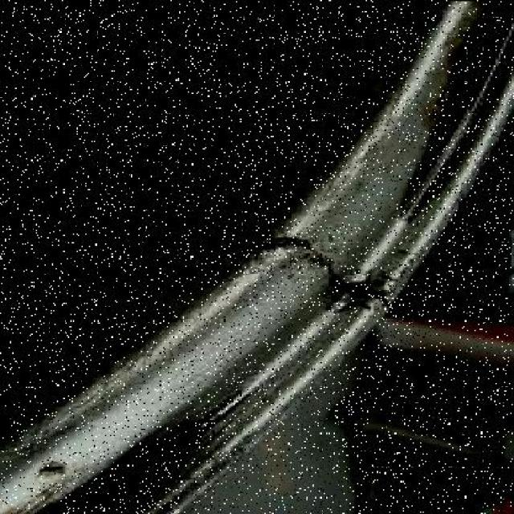
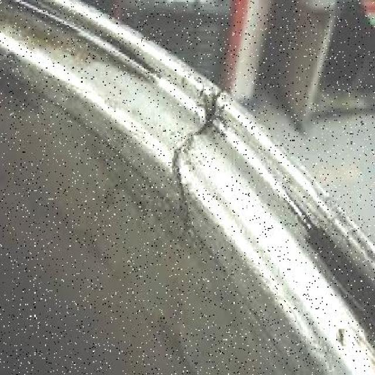
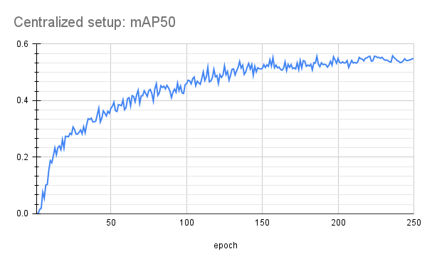
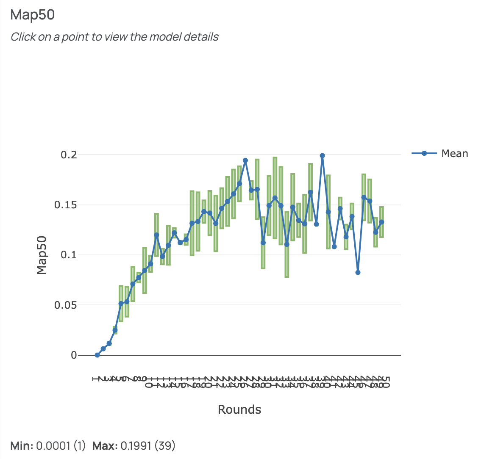
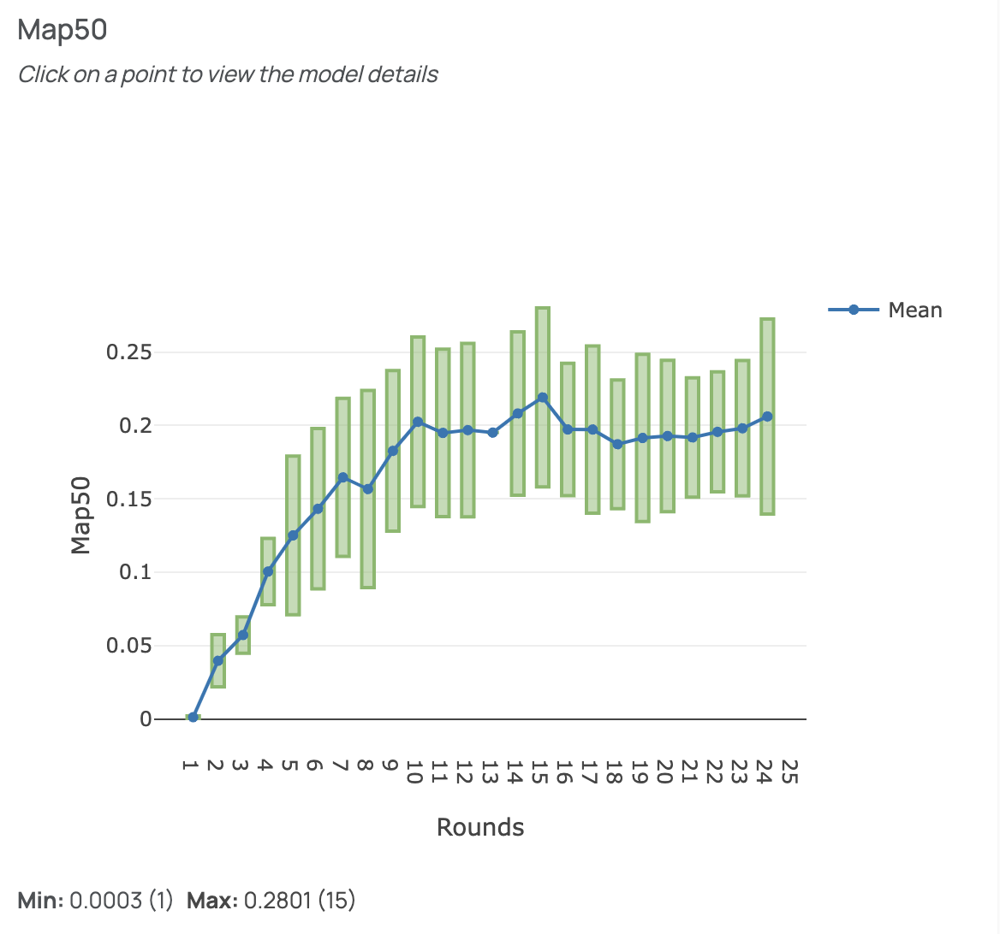
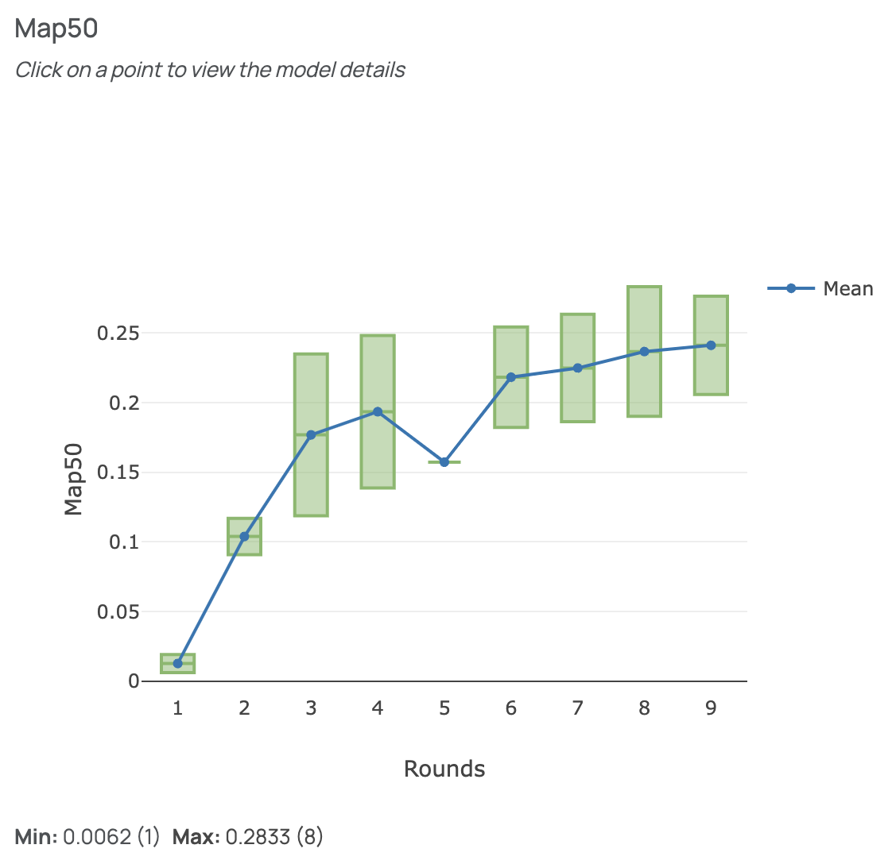

   **Note:**
   
   **One of the dependencies in this example has an APGL license. This dependy is used in this particular example and not in FEDn in general.**

   **If you are new to FEDn, we recommend that you start with the MNIST-Pytorch example instead: https://github.com/scaleoutsystems/fedn/tree/master/examples/mnist-pytorch**

# Welding Defect Object Detection Example

This is an example FEDn project that trains a YOLOv8n model on images of welds to classify them as "good", "bad", or "defected". The dataset is pre-labeled and can be accessed for free from Kaggle https://www.kaggle.com/datasets/sukmaadhiwijaya/welding-defect-object-detection. See a few examples below,







This example is generalizable to many manufacturing and operations use cases, such as automatic optical inspection. The federated setup enables the organization to make use of available data in different factories and in different parts of the manufacturing process, without having to centralize the data.


## How to run the example

To run the example, follow the steps below. For a more detailed explanation, follow the Quickstart Tutorial: https://scaleout.readthedocs.io/en/stable/quickstart.html

**Note: To be able to run this example, you need to have GPU access.**


### 1. Prerequisites

-  `Python >=3.8, <=3.12 <https://www.python.org/downloads>`__
-  `A project in FEDn Studio  <https://scaleout.scaleoutsystems.com/signup>`__  
-  `A Kaggle account  <https://www.kaggle.com/account/login?phase=startSignInTab&returnUrl=%2Fsignup>`__  
-  GPU access


### 2. Install FEDn and clone GitHub repo

Install fedn: 

``` 
pip install fedn
```

Clone this repository, then locate into this directory:

```
git clone https://github.com/scaleoutsystems/scaleout.git
cd fedn/examples/welding-defect-detection
```


### 3. Creating the compute package and seed model

Create the compute package:

```
scaleout package create --path client
```

This creates a file 'package.tgz' in the project folder.

Next, generate the seed model:

```
scaleout run build --path client
```

This will create a model file 'seed.npz' in the root of the project. This step will take a few minutes, depending on hardware and internet connection (builds a virtualenv).  

### 4. Running the project on FEDn

To learn how to set up your FEDn Studio project and connect clients, take the quickstart tutorial: https://scaleout.readthedocs.io/en/stable/quickstart.html. When activating the first client, you will be asked to provide your login credentials to Kaggle to download the welding defect dataset and split it into separate client folders.   


## Experiments with results

Below are a few examples of experiments which have been run using this example. A centralized setup has been used as baseline to compare against. Two clients have been used in the federated setup and a few different epoch-to-round ratios have been tested.


### Experimental setup

Aggregator: 
- FedAvg

Hyperparameters:
- batch size: 16
- learning rate: 0.01
- imgsz: 640

Approach: The number of epochs and rounds in each experiment are divided such that rounds * epochs = 250. 

#### Centralized setup

| Experiment ID| # clients	|  epochs	| rounds |
| -----------  | ---------- |  -------- | ------ |
| 0            | 1	        | 	250	    | 1      |

#### Federated setup

| Experiment ID| # clients	|  epochs	| rounds |
| -----------  | ---------- |  -------- | ------ |
| 1            | 2	        | 	5	    | 50     |
| 2            | 2          |   10      | 25     |
| 3            | 2	        | 	25	    | 10     |


### Results

Centralized:




Federated:







