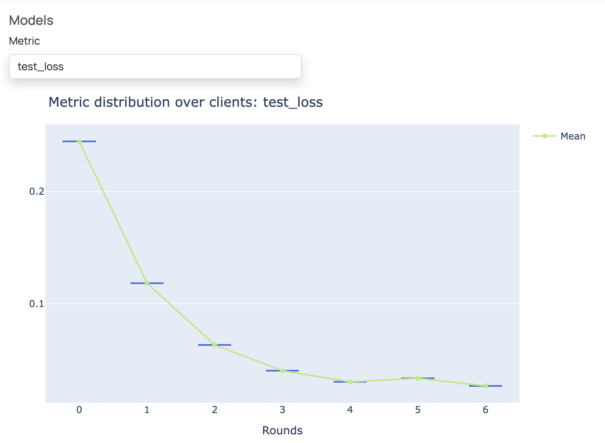

Hugging Face Transformer Example
--------------------------------

This is an example project that demonstrates how one can make use of the Hugging Face Transformers library in Scaleout Edge.
In this example, a pre-trained BERT-tiny model from Hugging Face is fine-tuned to perform spam detection 
on the Enron spam email dataset.

Email communication often contains personal and sensitive information, and privacy regulations make it 
impossible to collect the data to a central storage for model training.
Federated learning is a privacy preserving machine learning technique that enables the training of models on decentralized data sources.
Fine-tuning large language models (LLMs) on various data sources enhances both accuracy and generalizability.
In this example, the Enron email spam dataset is split among two clients. The BERT-tiny model is fine-tuned on the client data using 
federated learning to predict whether an email is spam or not.

The user interface visualizes the training progress by plotting test loss and accuracy, as shown in the plot below. 
After running the example for only a few rounds in FEDn studio, the BERT-tiny model - fine-tuned via federated learning - 
is able to detect spam emails on the test dataset with high accuracy. 

To run the example, follow the steps below. For a more detailed explanation, follow the documentation.

Prerequisites
-------------

-  `Python >=3.9, <=3.12 <https://www.python.org/downloads>`__
-  `A Scaleout Edge deployment  

Creating the compute package and seed model
-------------------------------------------

Install scaleout: 

.. code-block::

   git clone https://github.com/scaleoutsystems/scaleout.git
   cd scaleout/scaleout-client-python/examples/huggingface
   python -m venv .venv
   source .venv/bin/activate
   pip install scaleout

Create the compute package:

.. code-block::

   scaleout package create --path client

This creates a file 'package.tgz' in the project folder.

Next, generate the seed model:

.. code-block::

   scaleout run build --path client

This will create a model file 'seed.npz' in the root of the project.

Follow the documentation in order to learn how to connect clients and run the training yourself. 